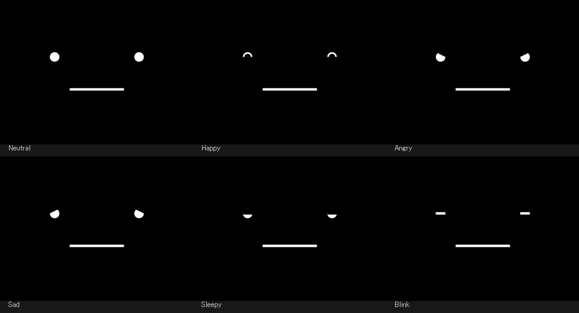

# stackchan-screensaver

PCを放置すると、スタックちゃん風の顔が現れる **Windows / macOS スクリーンセーバー**です。
瞬き・呼吸・視線移動に加えて、CPU使用率や電源の状態に応じて表情が変わります。

| OS | 形式 | 入手・使い方 |
| --- | --- | --- |
| Windows 10 / 11 | `.scr` + ウィンドウプレビュー `.exe` | [Windows版ダウンロード](https://github.com/bruiselea/stackchan-screensaver/releases/download/windows-v1.0.0-beta.1/StackchanSaver-Windows.zip) / [詳しい手順](windows-saver/README.md) |
| macOS | `.saver` | [ビルド・インストール手順](macos-saver/README.md) |

## Windows版 — v1.0.0-beta.1

**[リリース説明・ダウンロード](https://github.com/bruiselea/stackchan-screensaver/releases/tag/windows-v1.0.0-beta.1)**

1. リリースの `StackchanSaver-Windows.zip` をダウンロードして展開します。
2. まず **`StackchanSaver.exe`** を開くと、普通のウィンドウで試せます。Escか閉じるボタンで終了します。
3. セーバーとして使う場合は、保存しておくフォルダー内の **`StackchanSaver.scr` を右クリック → インストール**し、Windowsの設定画面で待ち時間などを指定します。

Windows 10 / 11、.NET Framework 4.8が対象です。C# / Windows Formsによる実装で、Node.js・Electron・追加の.NET SDKは不要です。
初回はプレビューリリースです。署名なしのバイナリを配布しています。

### 表情とプレビュー操作



| 優先順位 | PCの状態 | 表情 | プレビューで固定するキー |
| --- | --- | --- | --- |
| 1 | CPU使用率 > 70% | 怒り | A |
| 2 | AC電源接続 | 嬉しい | H |
| 3 | 電池残量 < 20% | 悲しい | D |
| 4 | 表示5分超 | 眠い | S |
| 5 | それ以外 | 通常 | N |

Space / 0で自動切り替えに戻ります。AC接続中のデスクトップも「嬉しい」になり、AC接続は眠い表情より優先されます。
Windows版では温度情報を取得しません。Windows設定内の小さいプレビューと、複数画面への全画面表示に対応しています。

### 遠隔環境での検証

**Windowsビルド26200 / .NET Framework 4.8 / x64環境で、自動テスト15項目に合格。**
実際にPCをスリープさせず、非表示のアプリウィンドウに復帰通知を送信して描画再開を確認しました。
高負荷・低電池・5分経過・2画面構成も模擬し、実際のSCRの埋め込み起動から親終了時の後片付けまでは5回連続で検証しています。

実際のハードウェアのスリープ復帰、RDP再接続、複数の実ディスプレイ、Windowsの無操作起動・サインイン連携は未検証です。
詳しくは [Windows版の検証結果](windows-saver/docs/TESTING.md) を参照してください。

ソースからビルドする場合:

```powershell
cd windows-saver
powershell -NoProfile -ExecutionPolicy Bypass -File .\build.ps1 -Test -Package
```

## macOS版

Mac を放置(無操作)すると、スタックちゃん風の顔が全画面に出る **macOS スクリーンセーバ (`.saver`)** です。
顔は [meganetaaan/m5stack-avatar](https://github.com/meganetaaan/m5stack-avatar) (MIT) の
挙動・座標・表情ロジックを参考に Swift (`ScreenSaverView`) へ再実装しています
（瞬き / 呼吸 / 視線移動）。

さらに、**Mac の状態に応じて表情が変わります**（プライバシー許可ダイアログ不要の範囲で取得）。

| 状態（上が優先） | 表情 |
|------|------|
| CPU 負荷が高い / 発熱 | 怒り（目の上を斜め三角でカット） |
| 充電中（電源接続） | 嬉しい（◠ の目） |
| バッテリー < 20% | 悲しい |
| 表示が長い（既定 5 分超） | 眠い（半目） |
| それ以外 | 通常 |

## 動作環境

- **動作確認: macOS 26.3（Apple Silicon）** — 作者の環境のみ。他バージョン/Intel は未検証
- **ビルドターゲット: macOS 11 (Big Sur) 以降**（arm64 / x86_64 ユニバーサル）
- ビルドに Xcode は不要。コマンドラインの `swiftc` のみ

## インストール（Xcode 不要・すべて CLI）

```bash
cd macos-saver
./build.sh open      # ビルド → ~/Library/Screen Savers へ導入 → スクリーンセーバ設定を開く
```

その後、システム設定 → スクリーンセーバ で **StackchanSaver** を選べば本番運用です。

- `./build.sh preview` … NSWindow で即プレビュー（`n`通常 / `h`嬉しい / `a`怒り / `d`悲しい / `s`眠い / `space`自動）
- `./build.sh install` … ビルドして導入のみ
- 仕組み・詳細は [`macos-saver/README.md`](macos-saver/README.md)

## 仕組み（要点）

`swiftc` で arm64 + x86_64 のユニバーサルバイナリを `.saver` バンドルとして組み立て、
ad-hoc 署名まで自動化。アイドル判定・全画面化・復帰は OS（ScreenSaver framework）任せなので、
オーバーレイや常駐の権限が不要です。状態取得は `getloadavg` / `ProcessInfo.thermalState` /
IOKit 電源情報など、許可ダイアログの出ない API を使用。

Windows版の実装・配布・検証方法は [windows-saver/README.md](windows-saver/README.md) を参照してください。

## 今後

- [x] **Windows版のプレビューリリース（C# / Windows Forms）**
- [ ] Windows実機のスリープ復帰・RDP再接続・複数ディスプレイでの確認
- [ ] 配布版（Developer ID 署名 + notarization）
- [ ] App Store 版（`.saver` を同梱するマネージャアプリ）
- [ ] 設定 UI（しきい値・色）

## ライセンス / クレジット

- 本リポジトリ: **MIT**（[`LICENSE`](LICENSE)）
- 顔の挙動・表情ロジックは **m5stack-avatar** by [@meganetaaan](https://github.com/meganetaaan)
  (Shinya Ishikawa, MIT, Copyright (c) 2018) を参考に再実装しています。
  素晴らしい原作に感謝します 🙏 詳細は [`THIRD-PARTY-NOTICES.md`](THIRD-PARTY-NOTICES.md)
- 「スタックちゃん / Stack-chan」の名称・キャラクターは [@meganetaaan](https://github.com/meganetaaan)
  氏のプロジェクト [stack-chan](https://github.com/meganetaaan/stack-chan) に由来します。
  本リポジトリは個人的な再実装であり、公式の製品ではありません。

---

# stackchan-screensaver (English)

## Windows preview release

The Windows port is available as a native `.scr` screensaver and a windowed `.exe` preview, implemented in C# / Windows Forms.
Requires Windows 10 / 11 and .NET Framework 4.8; no Electron, Node.js or additional .NET SDK is needed.

- [Download Windows v1.0.0-beta.1](https://github.com/bruiselea/stackchan-screensaver/releases/download/windows-v1.0.0-beta.1/StackchanSaver-Windows.zip) / [Release notes](https://github.com/bruiselea/stackchan-screensaver/releases/tag/windows-v1.0.0-beta.1).
- Extract the ZIP and open `StackchanSaver.exe` for a normal window. Press Esc to close; N/H/A/D/S select expressions and Space restores automatic selection.
- To register the screensaver, keep the extracted folder in a permanent location, right-click `StackchanSaver.scr`, choose Install, then configure it in Windows.
- 15 automated test groups pass, including simulated suspend/resume, two-monitor exit handling and five embedded-preview process lifecycles. No actual sleep, lock or remote disconnect is performed by the tests.
- Hardware resume, actual RDP reconnection, physical multi-monitor behavior and Windows idle/sign-in integration remain unverified. Binaries are unsigned and this is a prerelease.
- Windows uses CPU utilization and power status; thermal sensing is not implemented. AC power takes priority over low battery and sleepiness, including on desktop PCs.
- [Windows documentation](windows-saver/README.md) / [Validation details](windows-saver/docs/TESTING.md).

## macOS

A **macOS screen saver (`.saver`)** that shows a Stack-chan–style face full-screen
when your Mac is left idle. The face is a reimplementation in Swift (`ScreenSaverView`)
based on the behavior, geometry, and expression logic of
[meganetaaan/m5stack-avatar](https://github.com/meganetaaan/m5stack-avatar) (MIT)
— blinking, breathing, and gaze drift.

It also **changes expression based on your Mac's state** (using only APIs that don't
require a privacy permission prompt).

| State (top has priority) | Expression |
|------|------|
| High CPU load / thermal pressure | Angry (a diagonal cut over the eyes) |
| Charging (AC connected) | Happy (◠-shaped eyes) |
| Battery < 20% | Sad |
| Displayed for a long time (default > 5 min) | Sleepy (half-closed eyes) |
| Otherwise | Neutral |

## Requirements

- **Tested on macOS 26.3 (Apple Silicon)** — author's environment only; other versions / Intel are unverified
- **Build target: macOS 11 (Big Sur) or later** (arm64 / x86_64 universal)
- No Xcode required — builds with the `swiftc` command line only

## Install (no Xcode, all CLI)

```bash
cd macos-saver
./build.sh open      # build → install into ~/Library/Screen Savers → open Screen Saver settings
```

Then pick **StackchanSaver** in System Settings → Screen Saver.

- `./build.sh preview` … instant preview window (`n` neutral / `h` happy / `a` angry / `d` sad / `s` sleepy / `space` auto)
- `./build.sh install` … build and install only
- Details: [`macos-saver/README.md`](macos-saver/README.md)

## How it works

`swiftc` assembles an arm64 + x86_64 universal binary into a `.saver` bundle and
ad-hoc signs it. Idle detection, full-screen, and dismissal are handled by the OS
(ScreenSaver framework), so no overlay or background-agent permissions are needed.
State is read via permission-free APIs such as `getloadavg`,
`ProcessInfo.thermalState`, and IOKit power-source info.

The C# / Windows Forms port is available in [windows-saver](windows-saver/README.md).

## License / Credits

- This repository: **MIT** ([`LICENSE`](LICENSE))
- The face behavior / expression logic is reimplemented based on **m5stack-avatar** by
  [@meganetaaan](https://github.com/meganetaaan) (Shinya Ishikawa, MIT, Copyright (c) 2018).
  Huge thanks to the original work 🙏 See [`THIRD-PARTY-NOTICES.md`](THIRD-PARTY-NOTICES.md).
- The name and character "Stack-chan / スタックちゃん" originate from
  [@meganetaaan](https://github.com/meganetaaan)'s [stack-chan](https://github.com/meganetaaan/stack-chan)
  project. This repository is a personal reimplementation and is **not** an official product.
